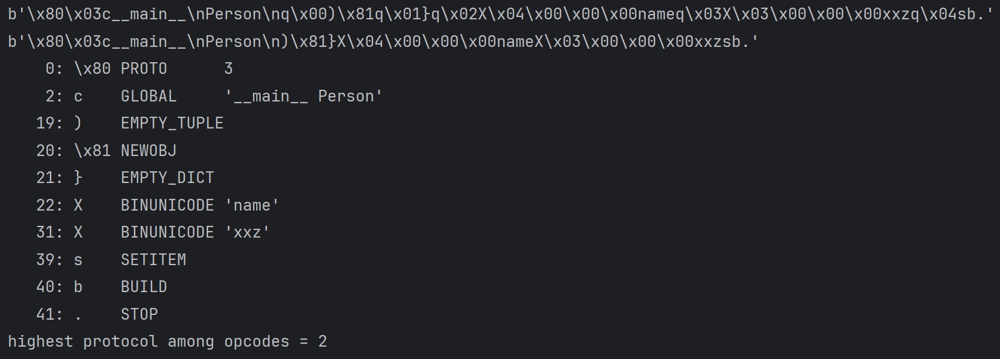
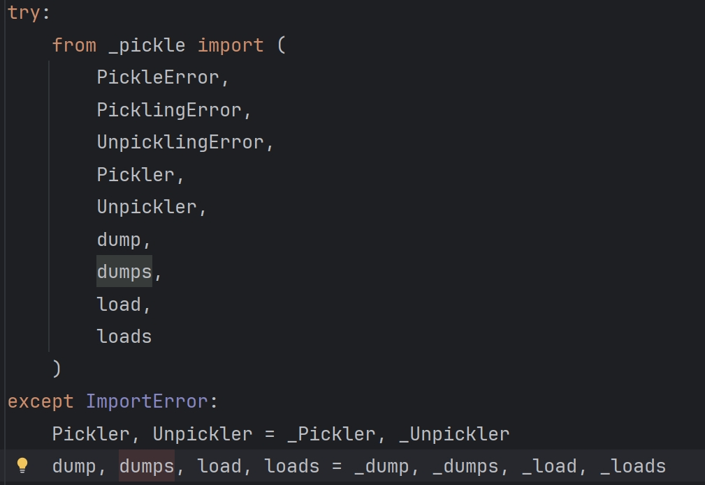

# pickle

​		`pickle` 是 Python 中的一个标准模块，主要用于将 Python 对象进行序列化（serialization）和反序列化（deserialization）操作。序列化是指将对象转化为一种可以存储或传输的格式（通常是字节流），而反序列化则是将存储或传输的字节流重新恢复为对象。

- **持久化存储：**在大语言模型中，`pickle` 可以帮助持久化存储中间数据和模型参数，方便后续使用。

- **数据传输：**在分布式训练或多模块协作的大语言模型框架中，`pickle` 可以将数据对象序列化为字节流，在不同的进程、机器或模块之间传递数据。

​		`pickle.py` 一共向外暴露 4 个方法：

- `dump(obj, file)`：没有返回，用于将对象序列化后存到指定的文件中，用于持久化存储
- `dumps(obj)`：方法返回序列化后的字符串，用于网络传输
- `load(file)`：方法没有返回值，从文件中读取字节流，重建其中特定对象的层次结构并返回
- `loads(data)`：重建并返回一个字节流 data 的对象层级结构

## pickle 的流行

- 功能特性

  通用性强，可以处理几乎所有的 Python 对象，这使得在不同类型的模型保存中都能发挥作用

  使用便捷，是 Python 的标准库模块，保存和加载模型只需要几行代码，无需复杂的配置和额外的依赖

- 性能效率

  `pickle` 通常比其他序列化格式更快，尤其是对于大型或复杂的对象图

  `pickle` 更高的协议版本可以提供更好的性能和更小的文件体积

- 兼容性和生态

  `pickle` 序列化的对象可以在不同的平台和 Python 版本之间传输和加载，更容易在不同的环境之间共享和使用模型

  作为 Python 的标准库，`pickle` 与其他 Python 库和工具的兼容性很好，可以方便地与数据处理、模型训练、评估等各个环节的工具进行集成

- 开发和维护

  `pickle` 是 Python 的内置标准库，经过了长期的测试和优化，具有较高的稳定性和可靠性

## pickle 版本

​		`pickle` 有很多版本，每个版本对同一个对象 `dump()` 得到的结果都不一样。在 `dump()\load()` 时可以用 `protocol` 参数指定协议版本，目前这些协议有 `0-5` 个版本，默认为 `4` 版本。所有版本中，0 号版本是最 human-readable 的，之后的版本加入了一大堆不可打印字符，不过这些新加的东西都只是为了优化，本质上没有太大的改动。

​		好消息是，`pickle` 协议是向前兼容的，0 号版本的字符串可以放心交给 `pickle.loads()`，不用担心意外

# pickletools

​		`pickletools` 是 python 自带的 pickle 调试器，有三个功能：**反汇编**一个已经被打包的字符串、**优化**一个已经被打包的字符串、返回一个迭代器来供程序使用。

# 初试 pickle/pickletools

```python
import pickle
import pickletools

class Person():
    name = "grn"
    def __init__(self):
        self.name = "xxz"

x = Person()
s = pickle.dumps(x, protocol=3)
print(s)
s = pickletools.optimize(s)
print(s)

pickletools.dis(s)
```

​		结果如下：



​		可以看到在经过 `pickletools.optimize()` 优化后，字符串明显变短了

# pickle.dumps() 

​		在调用`pickle.dumps()`时，根据`pickle.py`文件



​		实际上调用的是`_dumps()`方法[^5]。该方法中实际上是调用了`_Pickler.dump()`方法，将序列化后的 obj 放到`io.BytesIO()`中，并返回`io.BytesIO().getvalue()`方法返回的字符串。

​		在`_Pickler.dump()`方法中，实际上调用的是`self.save(obj)`方法，递归的序列化对象 obj，然后写入 `STOP`操作码，源码如下：

```python
def dump(self, obj):
    # 调用 self.save(obj) 方法，开始递归地序列化对象 obj
    self.save(obj)
    # 写入 STOP 操作码，表示序列化结束
    self.write(STOP)
    # 结束帧的写入
    self.framer.end_framing()
```

​		而`_Pickler.save()`方法部分源码如下：

```python
def save(self, obj, save_persistent_id=True):
    ...
    reduce = getattr(self, "reducer_override", None)
    if reduce is not None:
        rv = reduce(obj)
    else:
        ...
        reduce = getattr(obj, "__reduce_ex__", None)
        if reduce is not None:
            rv = reduce(self.proto)
        else:
            reduce = getattr(obj, "__reduce__", None)
            if reduce is not None:
                rv = reduce()
```

​		

# pickle.loads() 原理

​		可以看到上述结果，序列化后的 `s` 是一个二进制字节流[^1]，实际上 `pickle` 使用相对紧凑的二进制来存储。使用 `pickletools.dis()` 反汇编后，每一行都是一条指令，即字符串中包含了很多条指令。**这些指令一定以一个字节的指令码（opcode）开头**，接下来读取多少内容，由指令码来决定（每个指令码都已经严格规定好）。指令编码是紧凑的，一条指令结束后立刻就是下一条指令。

​		`pickle.loads()` 是一个 api，实际上底层实现是基于 `_Unpickler` 类，代码实现如下：

```python
def _load(file, *, fix_imports=True, encoding="ASCII", errors="strict",
          buffers=None):
    return _Unpickler(file, fix_imports=fix_imports, buffers=buffers,
                     encoding=encoding, errors=errors).load()

def _loads(s, /, *, fix_imports=True, encoding="ASCII", errors="strict",
           buffers=None):
    if isinstance(s, str):
        raise TypeError("Can't load pickle from unicode string")
    file = io.BytesIO(s)
    return _Unpickler(file, fix_imports=fix_imports, buffers=buffers,
                      encoding=encoding, errors=errors).load()
```

​		可以看出都是调用了 `_Unpickler.load()` 方法。在反序列化过程中，`_Unpickler` （后文称机器）会维护两个东西，栈区和存储区。<font color="honydew">栈是反序列化最核心的数据结构，为了应对数据嵌套，栈分为两部分：当前栈专注于维护最顶层的信息，而前序栈维护下层的信息</font>，大部分时候我们用不上存储区。

​		上面的指令码代表的意思也都能在 `pickle.py` 中找到，更详细的可以在 `pickletools.py` 中找到

​		一开始的指令码是`\x80` （这个操作符于版本 2 被加入），是协议开始的标记，机器读取到这个操作符后，会立刻去再去读一个字符`\x03`，表示 ”这是一个 `3` 号版本协议序列化的字符串“。

​		机器继续取出下一个字符为操作符 `c`。这个操作符（称为 GLOBAL 操作符），它连续读取两个字符串 `module` 和 `name`，[^2]规定以 `\n` 为分割；接下来把 `module.name` 压入栈。现在读取到的两个字符串分别是 `__main__` 和 `Person`，于是把 `__main__.Pseron` 入栈。

​		然后机器遇到了 `)` 操作符。它的作用是 ”把一个空的 tuple 压入栈“[^3]。处理完这个操作后，接下来程序读到了 `\x81` 这个操作符，它的作用是：从栈中弹出一个元素，记为 args；再弹出一个元素，记为 cls。接下来执行 `cls.__new__(cls, *args)`，然后把得到的东西压入栈。即从栈中弹出一个参数和一个 class，然后利用这个参数实例化 class，把得到的实例压入栈。

​		现在栈里只剩下一个元素，就是被实例化的 Person 对象，现在这里面什么都没有。因为实例化的时候，args 是一个空的数组。

​		继续下去，程序碰到了 `}` 操作符。这个操作符的意思是向栈内压入一个空的 dict。这个将是新实例的属性字典；紧接着 `X\x04\x00\x00\x00` 表示紧随了一个字符串，并且长度为 4，于是读取 `name`，这表示一个键为 `name` 的属性；又一个 `X\x03\x00\x00\x00` 表示又一个长度为 3 的字符串，于是继续读取 `xxz`，这是与键 `name` 相关联的值。

​		随后的 `s` 表示将前面的字符串按照两两一组分别为 `key : value` 存入空的 dict 中。

​		`b` 表示可以开始 BUILD 了，它会做些什么事呢？

​		- 把当前栈顶存进 state，然后弹掉

​		- 把当前栈顶记为 inst ，然后弹掉

​		- 利用 state 这一系列值来更新实例 inst[^4]，把得到的对象入栈

​		 上面的事干完了以后，栈里只剩下一个实例，类型是 `__main__.Person`，有一个属性是 `name`，值为 `xxz`。下一个指令是 `.`，即 STOP 指令。每个 pickle 字符串以它结束，读到这个指令，将栈中元素弹出收工。

​		全部工作做完了发现有一个地方似乎有点不对劲，`name = 'grn'` 这一句话在序列化时被忽略了，因为对于我们自定义的 class，如果直接以这种方式赋初值，不会被打包。解决方案是如代码中所示，写一个 `__init__` 方法。

[^1]:实际上都是一个字节一个字节，之所以打印出来是如图所示，是因为有些是不可打印字符，故表示为 `\x` ，可打印的字符则按照字符表显示为正常字符。
[^2]: GLOBAL 操作符读取全局变量，是使用的 `self.find_calss()` 函数。而 `find_class` 函数对于不用的协议版本实现不一样。总之，它的作用是 ”在模块 x 中找到 y“，注意 y 必须在 x 的顶层。
[^3]:		为什么这里是一个空的 tuple 呢？表示这个类没有基类，除了默认继承自 `object`
[^4]: 这里更新实例的方式是：如果 `inst` 拥有 `__setstate__` 方法，则把 `state` 交给 `__setstate__` 方法来处理；否则，否则直接把 `state` 这个 dist 的内容合并到 `inst.__dict__` 里面。

# \_\_reduce\_\_ 方法

​		`pickle` 的指令码 `R` 就是代表 `__reduce__` 方法，主要操作是：

​		- 取当前栈顶记为 args，并弹掉

​		- 取当前栈顶记为 f，并弹掉

​		- 以 args 为参数，执行函数 f，把结果入栈

​		class 的 `__reduce__` 方法，在 pickle 反序列化的时候会被执行。其底层的编码方法，就是利用了R指令码。

[^5]: 实际上官方更推荐用更快的\_pickle.py模块