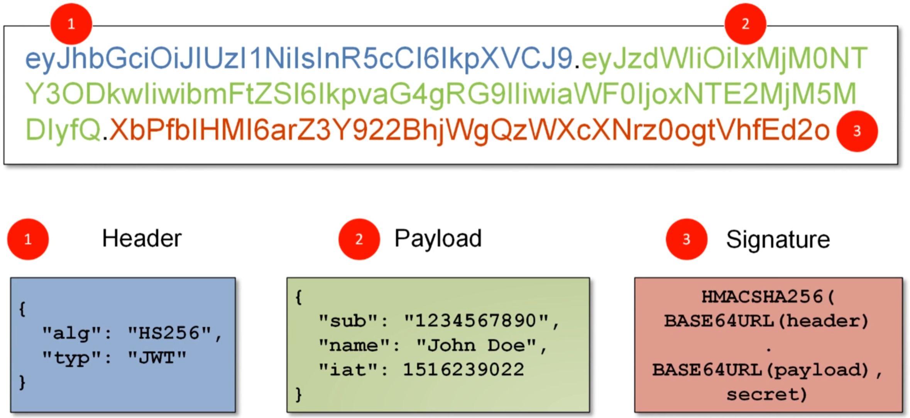

# JWT

## 1、概念

### 1.1 认证方式

		- session + cookie
		- jwt
		- token

### 1.2 概念

​		JWT (JSON Web Token) 是一个开放标准，用于在双方之间安全地表示声明。一种无状态的认证机制，通常用于授权和信息交换，是目前最流行的<font color="honydew">跨域认证</font>解决方案



### 1.3 数据结构

​		它是一个很长的字符串，中间用点（.）分隔成三个部分。注意，JWT 内部是没有换行的

​		JWT 的三个部分依次如下：Header（头部）、Payload（负载）、Signature（签名），写成一行，就是下面的样子。

```
Header.Payload.Signature
```

- header部分最常用的两个字段是 alg 和 typ。

​		alg 属性表示 token 签名的算法 (algorithm)，最常用的为HMAC和RSA算法

​		typ 属性表示这个 token 的类型（type），JWT 令牌统一写为JWT。

- Payload 部分也是一个 JSON 对象，用来存放实际需要传递的数据。JWT 规定了7个官方字段，供选用。

​		iss (issuer)：签发人

​		exp (expiration time)：过期时间

​		sub (subject)：主题

​		aud (audience)：受众

​		nbf (Not Before)：生效时间

​		iat (Issued At)：签发时间

​		jti (JWT ID)：编号

​		除了官方字段，还可以在这个部分定义私有字段

- Signature 部分是对前两部分的签名，防止数据篡改

​		首先，需要指定一个密钥（secret）。这个密钥只有服务器才知道，不能泄露给用户。然后，**使用 Header 里面指定的签名算法（默认是 HMAC SHA256）**，按照下面的公式产生签名。

```JSON
HMACSHA256(
  base64UrlEncode(header) + "." +
  base64UrlEncode(payload),
  secret)
```

​		算出签名以后，把 Header、Payload、Signature 三个部分拼成一个字符串，每个部分之间用"点"（.）分隔，就可以返回给用户。

## 2、漏洞介绍

### 2.1 潜在问题

- 缺乏机密性：我们能够轻松解码有效载荷 Payload（和报头 header）
- 用户插入另一个操作（例如删除）并绕过授权

### 2.2 漏洞方式

1. 算法为 none
2. 算法修改
3. 签名失败问题
4. 暴力破解
5. 密钥泄露
6. 令牌刷新

### 2.3 攻击思路

​		首先找到需要 JWT 鉴权后才能访问的页面，如个人资料页面，将该请求包重放测试：

​		（1）未授权访问：删除 Token 后仍然可以正常响应对应页面

​		（2）敏感信息泄露：通过 JWT.io 解密出 Payload 后查看其中是否包含敏感信息，如弱加密的密码等

​		（3）破解密钥 + 越权访问：通过 JWT.io 解密出 Payload 部分内容，通过空加密算法或密钥爆破等方式实现重新签发 Token 并修改 Payload 部分内容，重放请求包，观察响应包是否能越权查看其他用户资料

​		（4）检查 Token 时效性：解密查看 Payload 中是否有 exp 字段键值对，等待过期时间后再次使用该 Token 发送请求，若正常响应则存在 Token 不过期

​		（5）通过页面回显进行探测：如修改 Payload 中键值对后页面报错信息是否存在注入，payload 中 kid 字段的目录遍历问题与 SQL 注入问题

## 3、工具介绍

### 3.1 jet_tool

`git clone https://github.com/ticarpi/jwt_tool`

### 3.2 jet-cracker

此工具仅限于单一的签名算法（HS256）`https://github.com/lmammino/jwt-cracker`

### 3.3 c-jwt-cracker

`https://github.com/brendan-rius/c-jwt-cracker`