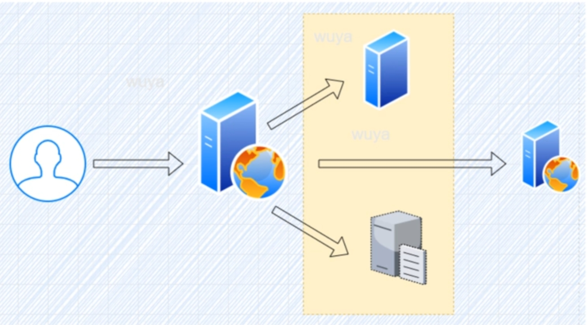

# SSRF

## 1、定义

​	Server-Side Request Forgery，服务器端请求伪造：是一种由攻击者构造形成由<font color="red">服务端</font>发起请求的一个安全漏洞



## 2、危害

​		（1）扫描资产

​		（2）获取敏感信息

​		（3）攻击内网服务器（绕过防火墙）

​		（4）访问大文件，造成溢出

​		（5）通过 Redis 写入 WebShell 或建立反弹连接

## 3、SSRF示例

```php
<?php
function curl($url){
        $ch = curl_init();
        //设置URL和相应的选项
        curl_setopt($ch, CURLOPT_URL, $url);
        curl_setopt($ch, CURLOPT_HEADER, 0);
        // 抓取URL并把它传递给浏览器
        curl_exec($ch):
        //关闭cURL资源，并且释放系统资源
        curl_close($ch);
}
$url = $_GET['url'];
curl($url);
?>
```

 ### 3.1 php curl扩展

​		获取网页资源——爬虫

​		webservice——获取接口数据

​		FTP——下载文件 

​		php.ini extension=php_curl.dll

### 3.2 可能导致SSRF漏洞的其他PHP函数

| 函数                | 作用                                   |
| ------------------- | -------------------------------------- |
| curl_exec()         | 执行cURL会话                           |
| file_get_contents() | 将整个文件读入一个字符串               |
| fsockopen()         | 打开一个网络连接或者一个Unix套接字连接 |

### 3.3 CURL其它协议

| 协议   | 作用      | payload                                                   |
| ------ | --------- | --------------------------------------------------------- |
| file   | 查看文件  | curl -v 'file///etc/passwd'                               |
| dict   | 探测端口  | http://localhost/ssrf/ssrf1.php?url=dict://127.0.0.1:3306 |
| gopher | 反弹shell | curl -v 'gopher://127.0.0.1:6379/__.....'                 |

dict协议：用于搭建在线字典服务
gopher协议：是一种信息查找系统本，只支持文本，不支持图像，已被HTTP替代

## 4、SSRF常见场景

​		社会化分享功能、转码功能、在线翻译、图片加载和下载功能、图片与文章收藏功能、网站采集与网站抓取

## 5、发现SSRF漏洞

​		**<font color="honydew">注：主要看服务器会不会存在读取第三方资源的情况</font>**

​		（1）爬取地址

​		（2）查看是否请求了其他资源

​		也可以用 google 语法搜索关键字：share, wap, url, link, src, source, target, u3g, display, sourceURL, imageURL, domain

## 6、SSRF漏洞的防御

​		（1）禁用协议

​		（2）限制请求端口

​		（3）设置URL白名单

​		（4）过滤返回信息

​		（5）统一错误信息